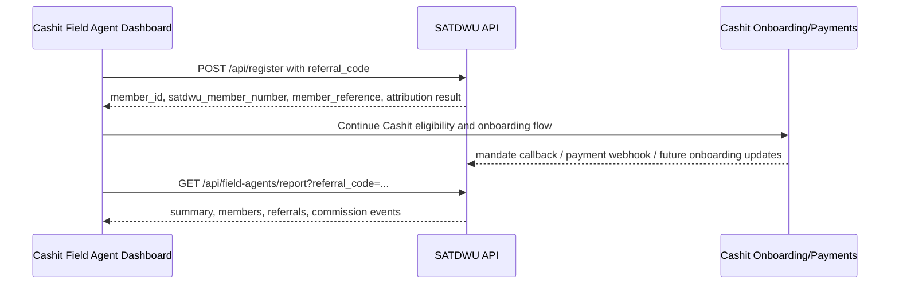

# Cashit Field Agent Registration And Reporting - Developer Instructions

Prepared for the Cashit Field Agent Dashboard team.

This document explains exactly how the Cashit Field Agent Dashboard should integrate with the SATDWU Membership Platform right now.

## 1. Objective

The Cashit Field Agent Dashboard should:

1. register a new SATDWU member into SATDWU
2. attach the correct Cashit field agent to that member using the field agent referral code
3. read SATDWU reporting data back for that field agent
4. display enough member status to help the field agent follow up

Important:

- SATDWU remains the source of truth for membership data
- Cashit remains the source of truth for Cashit onboarding, payment, and wallet/account readiness

## 2. High-Level Flow



## 3. SATDWU API Base URL

```text
https://satdwu-membership-294346590999.africa-south1.run.app
```

## 4. Step 1: Load Branches Before Rendering Registration

The dashboard should first fetch branches so the field agent chooses a valid SATDWU branch.

```http
GET /api/bootstrap
```

Use:

- `branches[].id` as the registration value
- `branches[].name` and `branches[].province` as the display label

## 5. Step 2: Register The Member Into SATDWU

Use:

```http
POST /api/register
Content-Type: application/json
```

The dashboard may also use:

```http
POST /api/field-agent/register
```

At the moment both behave the same way.

## 6. Required Registration Payload

The dashboard should send the full registration payload where possible, not only a minimal lead.

```json
{
  "full_name": "Driver Name",
  "first_name": "Driver",
  "surname": "Name",
  "mobile_number": "0820000000",
  "id_number": "9001015009087",
  "branch_id": "cape-town",
  "date_of_birth": "1990-01-01",
  "gender": "Male",
  "residential_address": "Khayelitsha, Cape Town",
  "work_categories": ["Driver"],
  "place_of_work": "Bellville Rank",
  "affiliation": "SANTACO",
  "income_frequency": "Monthly",
  "gross_monthly_income": "8000",
  "stop_order_accepted": true,
  "declaration_accepted": true,
  "member_signature_name": "Driver Name",
  "signed_at": "2026-06-24",
  "referral_code": "AGENT-RB-1643",
  "agent_slug": "roger-bezuidenhout",
  "source": "field_agent_dashboard"
}
```

## 7. Required Field-Agent Attribution Rules

To ensure the member is linked to the correct Cashit field agent:

- always send `referral_code`
- if available also send `agent_slug`
- set `source` to `field_agent_dashboard`

Recommended:

```json
{
  "referral_code": "AGENT-RB-1643",
  "source": "field_agent_dashboard"
}
```

This is the key link that allows:

- correct field-agent reporting
- later agent notifications
- later commission attribution

## 8. What The Dashboard Should Store From The Registration Response

After successful registration, the dashboard should store these returned values:

- `member_id`
- `satdwu_member_number`
- `member_reference`
- `field_agent_dashboard.referral_code`
- `field_agent_dashboard.field_agent_id`
- `field_agent_dashboard.report_url`
- `cashit_setup.status`
- `cashit_setup.message`

Example response excerpt:

```json
{
  "member_id": "7fb8c9e1-65d4-4eaa-b9a8-0c801f6f0d8b",
  "satdwu_member_number": "SATDWU-CAP-000001",
  "member_reference": "0820000000",
  "field_agent_dashboard": {
    "attributed": true,
    "referral_code": "AGENT-RB-1643",
    "field_agent_id": "agent_roger_bezuidenhout",
    "report_url": "/api/field-agents/report?referral_code=AGENT-RB-1643"
  },
  "cashit_setup": {
    "required": true,
    "status": "awaiting_cashit_eligibility",
    "message": "SATDWU member created. Next step is Cashit eligibility verification, then member onboarding via the currently published Cashit flow."
  }
}
```

## 9. What The Dashboard Should Show To The Field Agent Immediately After Registration

After a successful SATDWU registration, the field agent UI should show:

- SATDWU member number
- member cellphone number
- payment reference
- attribution confirmed yes/no
- next Cashit step

Recommended success-state wording:

- `SATDWU member created`
- `Referral linked to agent`
- `Next step: Cashit eligibility verification`

It should not say:

- `Cashit account created`
- `Cashit KYC complete`
- `Mandate approved`

unless Cashit has separately confirmed those states.

## 10. Step 3: Pull Field-Agent Reporting From SATDWU

The dashboard can read agent performance and member details from:

```http
GET /api/field-agents/report?referral_code=AGENT-RB-1643
```

Alternative supported forms:

```http
GET /api/referrals/AGENT-RB-1643/report
GET /api/field-agents/{field_agent_id}/report
```

Recommended lookup method:

- `referral_code`

## 11. Query Keys Supported By SATDWU

SATDWU accepts:

- `field_agent_id`
- `fieldAgentId`
- `agent_id`
- `agentId`
- `referral_code`
- `referralCode`
- `ref`
- `agent_slug`
- `agentSlug`
- `agent`
- `slug`

Recommended:

- use `referral_code`

## 12. Data The Dashboard Can Pull And Display

### Agent block

The `agent` object can be shown in the field-agent profile header:

- `id`
- `referralCode`
- `slug`
- `fullName`
- `status`

### Summary block

The `summary` object can power KPI cards:

- `registrations`
- `pending`
- `active`
- `unpaid`
- `suspended`
- `cancelled`
- `paidConversions`
- `commissionEarned`
- `commissionReversed`

### Referrals block

The `referrals` array can be used for referral audit data, including:

- `memberId`
- `referralCode`
- `fieldAgentId`
- `fieldAgentName`
- `source`
- `status`
- `commissionStatus`
- `createdAt`

### Members block

The `members` array is the most important for dashboard reporting.

The dashboard can show per member:

- SATDWU member number
- name
- mobile
- branch name
- province
- current SATDWU status
- registration origin
- grace expiry
- Cashit onboarding stage
- Cashit KYC stage
- mandate status
- Cashit account number if confirmed
- payment reference

### Commission events block

The `commissionEvents` array can be used to show:

- which members produced commission
- which commission entries were reversed
- amount per commission event
- when commission was earned

## 13. Recommended Field-Agent Dashboard Layout

### Top summary cards

- Registrations
- Active Members
- Payment Due
- Paid Conversions
- Commission Earned

### Member table columns

- Member Name
- SATDWU Number
- Mobile
- Branch
- SATDWU Status
- Cashit Stage
- Cashit KYC
- Mandate
- Payment Reference
- Cashit Account Number
- Grace Expiry

### Row actions

- View profile
- Follow up
- Open Cashit onboarding flow
- Open payment follow-up

## 14. Recommended Member Status Mapping For Dashboard Use

### SATDWU status

Use `member.status.key` and `member.status.label`.

Expected values:

- `pending`
- `active`
- `unpaid`
- `suspended`
- `cancelled`

### Cashit onboarding stage

Use `member.cashitWalletStatus.key` and `member.cashitWalletStatus.label`.

Expected current values:

- `eligibility_pending`
- `eligible`
- `ussd_registration_pending`
- `exists`
- `active`
- `verified`
- `ready`
- `failed`

### Cashit KYC stage

Use `member.kycStatus.key` and `member.kycStatus.label`.

Expected current values:

- `missing`
- `submitted`
- `pending`
- `verified`
- `failed`

### Mandate stage

Use `member.mandateStatus.key` and `member.mandateStatus.label`.

Expected current values:

- `not_requested`
- `pending`
- `approved`
- `declined`
- `cancelled`
- `expired`

## 15. Important Business Rules For Cashit Team

1. SATDWU registration alone does not earn commission.
2. Commission is created only after the first confirmed successful payment webhook.
3. SATDWU member number is the union identity and should be shown clearly.
4. `member_reference` is the current payment matching reference and should be retained in the dashboard.
5. The dashboard should not invent Cashit account creation or KYC completion before Cashit has actually confirmed those states.
6. SATDWU payment status changes only after confirmed Cashit payment results.

## 16. Error Handling Guidance

### Registration duplicate

If SATDWU returns `409`, show a clear message such as:

- `This mobile number or ID number already exists in SATDWU.`

### Missing fields

If SATDWU returns `400`, surface the `details` array to help the field agent correct the form.

### Unverified agent attribution

If SATDWU accepts the registration but `field_agent_dashboard.attributed` is `false`, the dashboard should:

- still keep the registration as created
- flag the attribution for back-office review

## 17. What The Cashit Team Does Not Need To Build Inside SATDWU

The Cashit team does not need to:

- create SATDWU member numbers themselves
- calculate SATDWU status themselves
- store a duplicate source-of-truth membership database
- recalculate commission logic independently from SATDWU

They should use the SATDWU APIs as the membership truth layer.

## 18. Next Cashit-Side Extensions Needed After This

After the current registration integration is live, the next Cashit-side improvements should be:

1. eligibility verification callback or lookup
2. account-created callback or lookup
3. KYC-complete callback or lookup
4. mandate-approved callback refinement
5. signed payment webhooks

That will allow the Cashit dashboard to move from:

- `member created and attributed`

to:

- `member fully onboarded and collectible`
