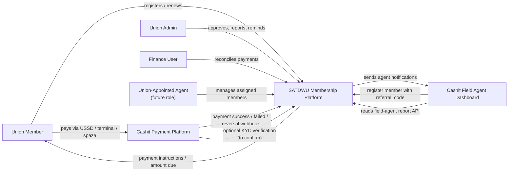
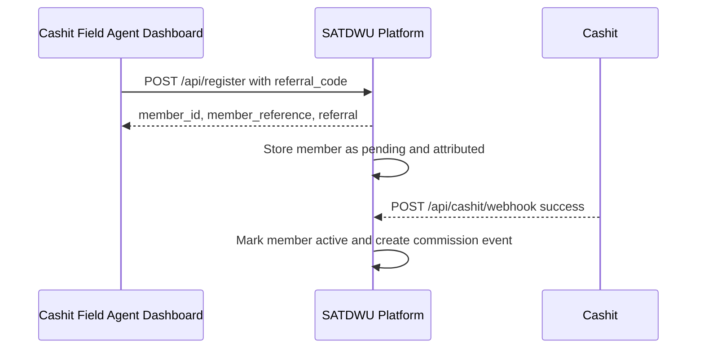
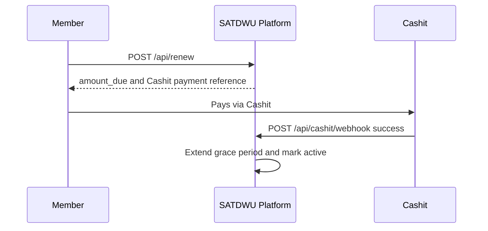

# SATDWU Membership Platform - Functionality And System Relationships

This document explains what the SATDWU Membership Platform does and how it relates to Cashit and the Cashit Field Agent Dashboard.

## 1. System Roles

### SATDWU Membership Platform

The SATDWU Membership Platform is the membership source of truth.

It owns:

- Member registration records
- SATDWU member status
- SATDWU member number
- Branch assignment
- Membership approval workflow
- Renewal status
- Payment matching against Cashit confirmations
- Unmatched payment reconciliation
- Referral attribution
- Commission event creation logic
- Union admin reporting
- Member portal
- Finance reconciliation tools

It should not treat a manual renewal click as payment. A member only becomes paid-up when Cashit confirms payment.

### Cashit

Cashit is the payment and payment-confirmation partner.

Cashit owns or should confirm:

- Cashit account number rules
- Whether the member cell number is always the Cashit account number
- Payment initiation, if supported
- USSD payment session, if supported
- Payment links, if supported
- Payment success/failure/reversal webhooks
- Webhook signing/security
- Cashit transaction IDs
- Cashit KYC reuse, if available

### Cashit Field Agent Dashboard

The Cashit Field Agent Dashboard is the field-agent operating surface.

It should own:

- Cashit field agent login
- Field agent referral code display
- Field agent profile
- Field agent performance reporting UI
- Cashit-side notification inbox
- Field-agent follow-up workflow

It can use SATDWU APIs to register members and retrieve SATDWU membership/reporting data.

### Union-Appointed Agent Dashboard

This is a future SATDWU role and should be separate from Cashit field agents.

It should own:

- Union-appointed agent login
- Assigned member list
- Overdue member list
- Reminder actions
- Communication history
- Union-agent performance reporting

## 2. High-Level Relationship Map



## 3. Core Workflows

## 3.1 Member Registration

### Direct SATDWU Registration

1. Member registers through the SATDWU platform.
2. SATDWU creates a pending member record.
3. SATDWU stores registration origin as `Direct`.
4. Union admin reviews and approves the member.
5. Member receives or sees payment instructions.
6. Member becomes paid-up only after Cashit confirms payment.

### USSD Registration

1. USSD service calls `POST /api/register`.
2. USSD passes member details and `source: "ussd"`.
3. SATDWU creates a pending member record.
4. SATDWU stores registration origin as `USSD`.
5. Payment and approval continue through the normal SATDWU/Cashit process.

### Cashit Field Agent Registration

1. Field agent opens the Cashit Field Agent Dashboard.
2. Dashboard registers the member through `POST /api/register`.
3. Dashboard passes `referral_code`, ideally `AGENT-RB-1643` style.
4. SATDWU creates the member.
5. SATDWU links the member to the field agent.
6. SATDWU stores registration origin as `Field Agent`.
7. Field agent commission is not earned yet.
8. Commission becomes earned only after the first confirmed Cashit payment.



## 3.2 Renewal And Payment

1. Member or external system calls `POST /api/renew`.
2. SATDWU returns amount due and payment instructions.
3. Member pays through Cashit.
4. Cashit sends payment webhook to SATDWU.
5. SATDWU matches payment using the payment reference.
6. SATDWU updates membership status.

Important rule:

SATDWU does not reset renewal status until Cashit confirms payment.



## 3.3 Payment Failure Or Reversal

If Cashit sends a failed payment event:

- SATDWU logs the failed transaction.
- SATDWU does not activate the member.

If Cashit sends a reversal:

- SATDWU logs the reversal.
- SATDWU moves the member to unpaid.
- SATDWU reverses the related commission if one exists.

## 3.4 Payment Reconciliation

If Cashit sends a successful payment but SATDWU cannot match the payment reference:

1. SATDWU logs the payment in the unmatched queue.
2. Finance user opens the Finance page.
3. Finance links the payment to the correct member.
4. SATDWU activates/renews the member.
5. SATDWU creates commission if applicable.

## 3.5 Field Agent Notification

When an admin sends a fee reminder to a referred member:

1. SATDWU creates an internal member reminder.
2. SATDWU checks whether the member has a referral code.
3. SATDWU sends a notification to Cashit Field Agent Dashboard.
4. Cashit shows the notification to the matching field agent.

SATDWU-to-Cashit endpoint:

```http
POST https://cashit.africa/api/post_agent_notification.php
X-SADTWU-NOTIFICATION-TOKEN: <shared secret token>
```

Payload:

```json
{
  "referral_code": "AGENT-RB-1643",
  "type": "PAYMENT_REMINDER",
  "title": "Membership payment due",
  "message": "Please follow up with this member for their monthly SADTWU renewal.",
  "action_url": "membership.php"
}
```

## 4. Data Ownership

| Data / Function | SATDWU Platform | Cashit | Cashit Field Agent Dashboard |
|---|---:|---:|---:|
| SATDWU member record | Owner | No | Reads via API |
| SATDWU member number | Owner | No | Reads via API |
| Cashit account number | Stores reference | Owner / confirm rules | May display |
| Payment success/failure/reversal | Receives and applies | Owner / sends event | Reads summary |
| Member approval | Owner | No | No |
| KYC status | Owner or stores Cashit result | Possible source | May assist |
| Field agent referral code | Stores | Owner/source | Owner/display |
| Commission event | Creates based on payment | To confirm payout owner | Displays/uses |
| Agent notifications | Sends | Receives | Displays |
| Finance reconciliation | Owner | No | No |

## 5. Pages Built In SATDWU Platform

### Login Page

Separates user experiences.

Current roles:

- Member
- Admin

Planned roles:

- Finance
- Union-appointed agent

### Member Portal

Shows:

- SATDWU membership status
- SATDWU member number
- Cashit payment account/cell number
- Monthly fee
- Grace expiry
- Renewal instruction

Direction:

SATDWU member number should become the primary identity. Cashit cell/account number should be the payment method.

### Union Dashboard

Shows:

- Registered members
- Paid-up members
- Payment due members
- Collections
- Status mix
- Collections trend
- Field agent activity
- Unified member registry

Recent change:

On mobile, the top four cards are now compact and shown in one row.

### Unified Member Registry

Shows member list and operational actions.

Current columns include:

- Member
- Origin: `USSD`, `Field Agent`, or `Direct`
- Branch
- Status
- Reference
- Grace expiry
- Actions

Current actions:

- Review
- Approve
- KYC reminder
- Fee reminder

### Finance Page

Shows:

- Unmatched Cashit payment queue
- Transaction ledger
- Manual link action for unmatched payments

### Cashit Tester Page

Development/testing page for:

- Successful payment webhook
- Failed payment webhook
- Reversal webhook

Future:

Replace this with integration health and webhook logs. Keep tester restricted to development/admin-only use.

## 6. APIs Used Between Systems

### Cashit / Field Agent Dashboard To SATDWU

| Purpose | Method | Endpoint |
|---|---|---|
| Register member | `POST` | `/api/register` |
| Check renewal amount | `POST` | `/api/renew` |
| Check member status | `GET` | `/api/status/{member}` |
| Field-agent report | `GET` | `/api/field-agents/report?referral_code=...` |
| Referral report | `GET` | `/api/referrals/{referral_code}/report` |
| Payment webhook | `POST` | `/api/cashit/webhook` |

### SATDWU To Cashit

| Purpose | Method | Endpoint |
|---|---|---|
| Field agent notification | `POST` | `https://cashit.africa/api/post_agent_notification.php` |

## 7. Important Business Rules

1. A registration does not mean commission is earned.
2. Commission is earned only after first confirmed Cashit payment.
3. A renewal button does not make a member paid-up.
4. Paid-up status changes only after Cashit payment confirmation.
5. Reversals must move the member back to unpaid.
6. Reversals must reverse the related commission event.
7. Unmatched payments must go to finance reconciliation.
8. SATDWU member number is the union identity.
9. Cashit account/cell number is the payment identity.
10. Cashit field agents and union-appointed agents are different roles.

## 8. Next Functional Builds

### 8.1 Separate Admin And Finance Roles

Finance should be able to:

- View transactions
- Reconcile unmatched payments
- View payment reports

Finance should not automatically be able to:

- Approve members
- Change union admin settings
- Manage roles

### 8.2 Union Agent Dashboard

Union-appointed agents need a separate dashboard from Cashit field agents.

They should see:

- Assigned members
- Overdue members
- Recently paid members
- Renewal reminders sent
- Communication history
- Performance summary

### 8.3 Clickable Dashboard Cards

Top dashboard cards should open/filter detail views:

- Registered members -> full registry
- Paid-up members -> active members
- Payment due -> overdue members and bulk reminder action
- Collections -> transaction report

### 8.4 Cashit Payment Initiation

If Cashit supports it, SATDWU should call Cashit to:

- Create payment intent
- Start USSD session
- Generate payment link
- Track pending payment state

### 8.5 KYC Integration

SATDWU should reuse Cashit KYC if:

- Cashit KYC is legally shareable.
- Consent is handled.
- Cashit can provide status/evidence/reference.

Fallback:

- SATDWU keeps manual KYC upload/review.

## 9. Open Cashit Questions

The detailed Cashit question tracker is in:

```text
CASHIT_INTEGRATION_QUESTIONS.md
```

Most important unresolved items:

- Official Cashit account number rule.
- Payment initiation support.
- USSD session support.
- Payment link support.
- Webhook signing.
- Idempotency/retry rules.
- KYC reuse.
- Commission payout ownership.

